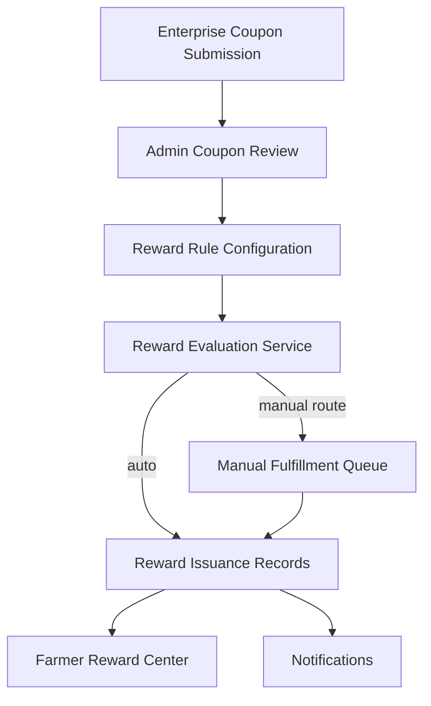

# Design Document

## Overview

The content reward mechanism extends the community module by adding configurable reward rules that leverage existing engagement metrics to grant sponsored coupons, badges, or special recognitions. The design introduces enterprise-managed coupon templates, administrator-controlled reward rules, evaluation services that run on queued jobs, and farmer-facing reward surfaces.

## Steering Document Alignment

### Technical Standards (tech.md)
- Follow Laravel service/action patterns for business logic.
- Use Sanctum-authenticated APIs and Filament v4 panels per role segregation.
- Persist sensitive data with encryption where necessary (e.g., coupon codes).

### Project Structure (structure.md)
- Place Eloquent models under `app/Models` with proper relationships.
- Store Filament resources under `app/Filament/{Panel}/Resources`.
- House business services in `app/Services/Community/Rewards` and jobs in `app/Jobs`.

## Code Reuse Analysis

### Existing Components to Leverage
- **CommunityPost model**: already tracks `views`, `likes`, `replies_count` metrics for posts.
- **CommunityPostLike model/table**: supports unique like tracking per user for threshold verification.
- **Notification infrastructure**: reuse existing notification channels for informing farmers.
- **Filament v4 component library**: 必须严格遵循 V4 的命名空间与组件导入规范；若有疑问需通过 Context7 MCP 获取 Filament v4 官方文档确认。

### Integration Points
- **Filament admin/enterprise panels**: extend with new resources for coupon templates and reward rules.
- **Voucher subsystem**: integrate with future `coupons` domain for reusability; initial implementation scoped to reward issuance records.
- **Queue workers**: evaluation jobs triggered on engagement updates or periodic scans.

## Architecture

The system is composed of four subdomains:
1. **Coupon Templates** (enterprise submission + admin approval)
2. **Reward Rules** (admin configuration)
3. **Reward Evaluation & Issuance** (queue jobs/services)
4. **Farmer Reward Center** (API + personal center view)



### Modular Design Principles
- **Single File Responsibility**: models represent data definitions; services encapsulate rule evaluation or issuance logic.
- **Component Isolation**: separate enterprise panel resources from admin panel resources.
- **Service Layer Separation**: use services for reward evaluation (`RewardEvaluator`), issuance (`RewardIssuer`), and notification dispatch (`RewardNotifier`).
- **Utility Modularity**: common helper for computing thresholds from `CommunityPost` metrics.

## Components and Interfaces

### Component 1: CouponTemplate (Model + Filament Resources)
- **Purpose:** Persist enterprise-submitted coupon templates with platform/store metadata and approval states.
- **Interfaces:** `CouponTemplate` model with scopes (`approved`, `pending`), relationships to `Enterprise` and `RewardRule`.
- **Dependencies:** `Enterprise` model, admin review flow.
- **Reuses:** Filament form components（引用命名空间遵循 v4 标准，例如 `Filament\Forms\Components`）、authorization policies。

### Component 2: RewardRule (Model + Filament Resource)
- **Purpose:** Store threshold configuration (metric, comparator, value), fulfillment mode, linked reward assets (coupon template IDs, badge types).
- **Interfaces:** `RewardRule::eligiblePosts()` query scope; relation to `CouponTemplate`; `RewardRuleMetric` enum.
- **Dependencies:** `CommunityPost` metrics, `CouponTemplate` approvals.
- **Reuses:** Validation traits, queue dispatching when rules change, Filament v4 表单/表格组件（严格使用 v4 命名空间与 API）。

### Component 3: RewardEvaluator Service + Job
- **Purpose:** Evaluate post engagement metrics against reward rules whenever metrics change or on scheduled sweep.
- **Interfaces:** `RewardEvaluator::evaluatePost(CommunityPost $post)`; queued job `EvaluatePostRewardsJob` triggered on like/reply events.
- **Dependencies:** `RewardRule`, `RewardIssuance` repository, `RewardIssuer`.
- **Reuses:** existing event broadcasting for likes and replies.

### Component 4: RewardIssuer Service
- **Purpose:** Create issuance records, guard idempotency, decrement coupon stock, and dispatch notifications.
- **Interfaces:** `RewardIssuer::issueCoupon(RewardRule $rule, CommunityPost $post, Farmer $author, bool $manual = false)`.
- **Dependencies:** `RewardIssuance` model, `CouponTemplate`, `Notification` classes.
- **Reuses:** Database transactions, audit logging helpers.

### Component 5: Farmer Rewards API Controller
- **Purpose:** Provide endpoints for farmers to list rewards, mark as used, and view details.
- **Interfaces:** `GET /api/rewards`, `POST /api/rewards/{id}/acknowledge`, `POST /api/rewards/{id}/mark-used`.
- **Dependencies:** `RewardIssuance` repository, Sanctum token auth.
- **Reuses:** API responder utilities, policy checks.

## Data Models

### CouponTemplate
```
- id: uuid
- enterprise_id: uuid (nullable until linked)
- title: string (display name)
- platform: enum('jd','taobao','offline','other')
- store_name: string
- store_url: string
- face_value: decimal(10,2)
- total_quantity: integer|null (null = unlimited)
- valid_from: datetime
- valid_until: datetime
- usage_instructions: text
- status: enum('draft','pending_review','approved','rejected')
- submitted_by: uuid (enterprise user)
- reviewed_by: uuid|null (admin user)
- reviewed_at: datetime|null
- rejection_reason: text|null
- created_at / updated_at
```

### RewardRule
```
- id: uuid
- name: string
- metric: enum('likes','views','replies')
- comparator: enum('gte')
- threshold: unsigned integer
- fulfillment_mode: enum('automatic','manual')
- coupon_template_id: uuid|null
- badge_type: enum|null (future use)
- lecturer_program: boolean default false
- is_active: boolean
- created_by: uuid (admin user)
- updated_by: uuid (admin user)
- created_at / updated_at
```

### RewardIssuance
```
- id: uuid
- reward_rule_id: uuid
- coupon_template_id: uuid|null
- farmer_user_id: uuid
- community_post_id: uuid
- status: enum('pending_review','ready','issued','used','expired','cancelled')
- issued_by: uuid|null (admin user when manual)
- issued_at: datetime|null
- expires_at: datetime|null
- coupon_code: string|null (if unique codes are used)
- store_platform: string
- store_name: string
- store_url: string
- face_value: decimal(10,2)
- usage_instructions: text
- audit_log: json (history of actions)
- created_at / updated_at
```

### RewardAuditLog (optional table or JSON column)
```
- id: uuid
- reward_issuance_id: uuid
- action: enum('evaluated',' queued_manual','approved_manual','issued','notification_sent')
- actor_id: uuid|null
- metadata: json
- created_at
```

## Error Handling

### Error Scenario 1: Coupon stock exhausted
- **Handling:** `RewardIssuer` checks remaining quantity; throws domain exception; rule evaluation logs failure; admin notified to replenish or disable rule.
- **User Impact:** Farmer sees reward marked as unavailable with explanation; admin panel shows alert.

### Error Scenario 2: Coupon template revoked after rule assignment
- **Handling:** Rule evaluation validates template status; if not approved/active, the rule enters suspended state and generates admin warning.
- **User Impact:** No new rewards issued; administrators must repair configuration.

### Error Scenario 3: Concurrent issuance race
- **Handling:** use database transactions with `SELECT ... FOR UPDATE` on issuance table or unique constraint `(reward_rule_id, community_post_id, farmer_user_id)` to guarantee idempotency.
- **User Impact:** Farmer receives single reward; duplicate attempts are ignored.

## Testing Strategy

### Unit Testing
- Verify `RewardEvaluator` threshold logic for each metric type.
- Test `RewardIssuer` stock decrement and idempotency guard.
- Validate model scopes (approved templates, active rules).

### Integration Testing
- Simulate enterprise submission → admin approval → rule configuration → post reaching threshold to ensure end-to-end flow.
- Test manual fulfillment queue where admin approves issuance.

### End-to-End Testing
- API scenario: farmer creates post, accumulates likes, rule triggers, reward appears in personal center, farmer uses coupon.
- Admin scenario: manage pending coupon templates and manual reward queue.
```
